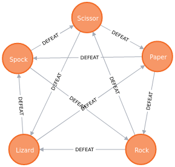

# JokenPo

Projeto de um jogo de JoKenPo utilizando o banco de dados baseado em grafo Neo4J
a idéia é que sejam cadastradas as possíveis ações para os jogadores no formato 

## Stack 
* Java 14;
* Spring boot
* Neo4J
* NodeJS
* Docker
* CassandraDB
* RabbitMQ
* Gradle

```json
{
	"action_name": "Scissor",
	"defeat" : [
		"Paper",
		"Lizard"
	], 
	"defeated_by": [ "Rock" ]
}
```

dizendo qual é o nome da ação e quais ações ganham dessa
No exemplo:
A ação tesoura vence Papel e lagarto, mas perde para pedra.




TODO

Gravar histórico de jogadas em um banco timestamp;
Terminar o Front end para interação do usuário (está em fase de construção);